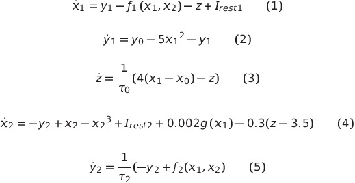
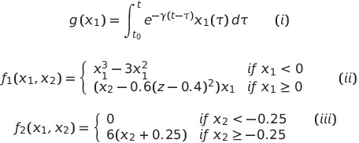
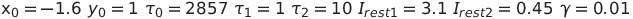
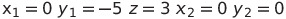
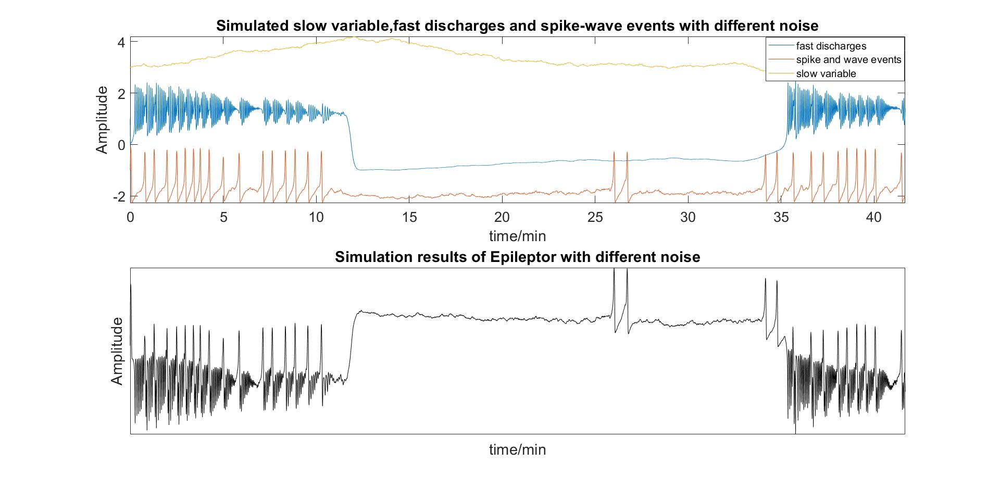

# Epileptor
This is a MATLAB implementation of the model Epileptor which was introduced in [1]. It contains a group of five differential equations based on bifurcation theory in nonlinear dynamics to create seizure-like events:
> * Saddle-node bifurcation ( x_1, y_1) : fast discharges (short time scale);
> * Homoclinic bifurcation (x_2, y_2) : spike and wave events (intermediate time scale);
> * Slow variable (z): alternation between normal/ictal periods (slow time scale);

The full set equations are listed below:

where

parameter settings: 

The initial conditions for the numerical simulation are 

Usually, you can solve equations (1-5) directly by ordinary differential equation solvers like ode45 in MATLAB. However, because of the existence of conditions (i-iii) and introduced additive Gaussian white noise, Epileptor turns into stochastic differential equations (SDEs). It is not trivial to solve such equations. I spend about two months on this problem.

First, condition (i) is an integral equation and needs to be incorperated into equation (1-5) in differential form by differentiation. Then SDEs are numerically solved by Euler-Maruyama method.

After running the script, you will get the results like this:

There are some insights I have gained from Epileptor: (1) basic computational neuroscience knowledge in nonlinear dynamics especially bifurcation theories; (2) potential rhythms underlying the evolution in epilepsy which is currently what I am working on.

The test environment of the script is MATLAB2018b. It should work for most MATLAB version because no advanced toolbox is needed. I hope this script could help you a little in epilepsy research and solving SDEs.

Some papers and books which help me a lot in developing this script are listed below for reference:

[1] V. K. Jirsa, W. C. Stacey, P. P. Quilichini, A. I. Ivanov, and C. Bernard, “On the nature of seizure dynamics,” Brain, vol. 137, no. 8, pp. 2210–2230, Jun. 2014.

[2] S. H. Strogatz, “Nonlinear Dynamics and Chaos,” May 2018.

[3] G. B. Ermentrout and D. H. Terman, “Mathematical Foundations of Neuroscience,” Interdisciplinary Applied Mathematics, 2010.

[4] T. Sauer, “Computational solution of stochastic differential equations,” Wiley Interdisciplinary Reviews: Computational Statistics, vol. 5, no. 5, pp. 362–371, Aug. 2013.

