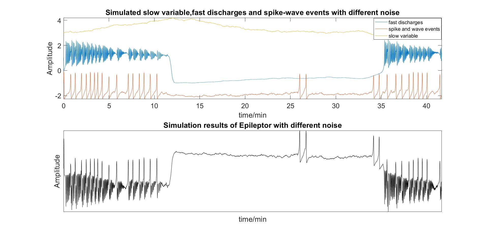

# Epileptor
This is a MATLAB implementation of the model Epileptor which was introduced in [1]. It contains a group of five differential equations based on bifurcation theory in nonlinear dynamics to create seizure-like events:
> * Saddle-node bifurcation ( $𝑥_1$, $𝑦_1$) : fast discharges (short time scale);
> * Homoclinic bifurcation ($𝑥_2$, $𝑦_2$) : spike and wave events (intermediate time scale);
> * Slow variable ($z$): alternation between normal/ictal periods (slow time scale);

The full set equations are listed below:

$${\dot{x}}_1=y_1-f_1\left(x_1,x_2\right)-z+I_{rest1} \tag {1}$$
$${\dot{y}}_1=y_0-5{x_1}^2-y_1 \tag {2}$$
$$\dot{z}=\frac{1}{\tau_0}(4(x_1-x_0)-z) \tag {3}$$
$${\dot{x}}_2=-y_2+x_2-{x_2}^3+I_{rest2}+0.002g\left(x_1\right)-0.3(z-3.5) \tag {4}$$
$${\dot{y}}_2=\frac{1}{\tau_2}(-y_2+f_2(x_1,x_2) \tag {5}$$
where

$$g\left(x_1\right)=\int_{t_0}^{t} e^{-\gamma(t-\tau)}x_1(\tau)\, d\tau \tag {i}$$

$$ f_1(x_1,x_2)= \left\{ \begin {array} {ll} 
x_1^3-3x_1^2 & if \ x_1 < 0 \\
(x_2-0.6(z-0.4)^2)x_1 & if \ x_1 \geq 0
\end {array} 
\right. \tag {ii} $$

$$ f_2(x_1,x_2)= \left\{ \begin {array} {ll} 
0 & if \ x_2 < -0.25 \tag {iii}\\
6(x_2+0.25) & if \ x_2 \geq -0.25
\end {array} 
\right. $$
and $x_0=-1.6$; $y_0=1$; $\tau_0=2857$; $\tau_1=1$; $\tau_2=10$; $I_{rest1}=3.1$; $I_{rest2}=0.45$; $\gamma=0.01$; The initial conditions for the numerical simulation are $x_1=0$; $y_1=-5$; $z=3$; $x_2=0$; $y_2=0$. 

Usually, you can solve equations (1-5) directly by ordinary differential equation solvers like ode45 in MATLAB. However, because of the existence of conditions (i-iii) and introduced additive Gaussian white noise. Epileptor turns into stochastic differential equations (SDEs). It is not trivial to solve such equations. I spend about two months on this problem.

First, condition (i) is an integral equation and needs to be incorperated into equation (1-5) in differential form by differentiation. Then SDEs are numerically solved by Euler-Maruyama method.

After running the script, you will get the results like this:

There are some insights I have gained from Epileptor: (1) basic computational neuroscience knowledge in nonlinear dynamics especially bifurcation theories; (2) potential rhythms underlying the evolution in epilepsy which is currently I am working on.

The test environment of the script is MATLAB2018b. It should work for most MATLAB version because no advanced toolbox is needed. I hope this script could help you a little in epilepsy research and solving SDEs.

Some papers and books which help me a lot in developing this script are listed below for reference:

[1] V. K. Jirsa, W. C. Stacey, P. P. Quilichini, A. I. Ivanov, and C. Bernard, “On the nature of seizure dynamics,” Brain, vol. 137, no. 8, pp. 2210–2230, Jun. 2014.

[2] S. H. Strogatz, “Nonlinear Dynamics and Chaos,” May 2018.

[3] G. B. Ermentrout and D. H. Terman, “Mathematical Foundations of Neuroscience,” Interdisciplinary Applied Mathematics, 2010.

[4] T. Sauer, “Computational solution of stochastic differential equations,” Wiley Interdisciplinary Reviews: Computational Statistics, vol. 5, no. 5, pp. 362–371, Aug. 2013.

